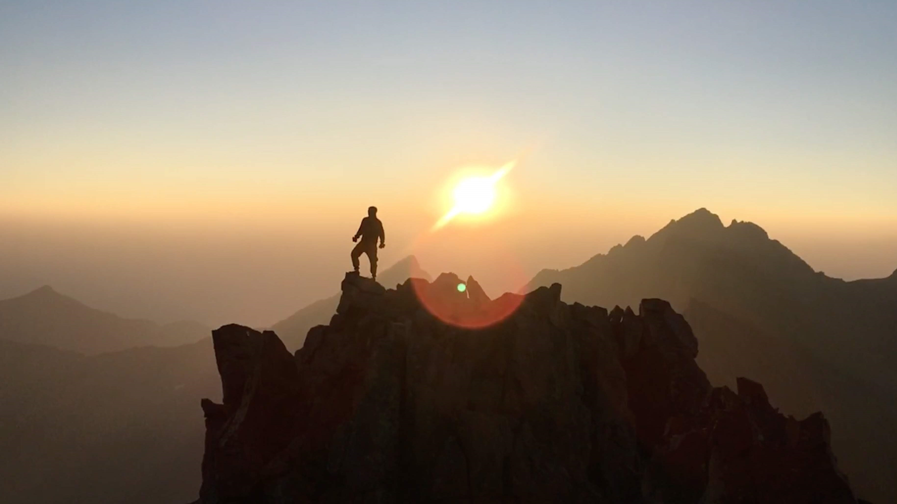

**<blockquote>"I wasn't born here, but I got here as soon as I could"</blockquote>**

...is something your bound to hear sooner or later after you've spent some time in Colorado. Sure, it would have been nice to grow up living in the rocky mountains, but I grew up in Houston, so I got here as soon as I could.

## Colorado has so much to offer
Being such a beautiful state full of opportunity and adventure, it makes sense why the natives are proud to be from here and why others such as my self made the move from Texas to Colorado as soon as they could. Home to some of the most beautiful places in the world and currently one of the best ecconomies in the country, it's worth moving to Colorado.

## From 14ers to cozy coffee shops
There is something for eveyone in Colorado, from world renouned ski resorts, to a swath of breweries, numerous coffee shops, and some of the most breath taking beauty in the country, it's easy for anyone to feel at home in Colorado. Since moving to Colorado I've climbed 57 of the 58 14ers, have skiid at over a dozen resorts, sipped coffee at over 100 of the coziest coffee shops, and spent many nights sleeping under the stars.

## Always more to discover
In the 6 years since making the move to Colorado, I've explored most of the state and am still discovering new things every day.

