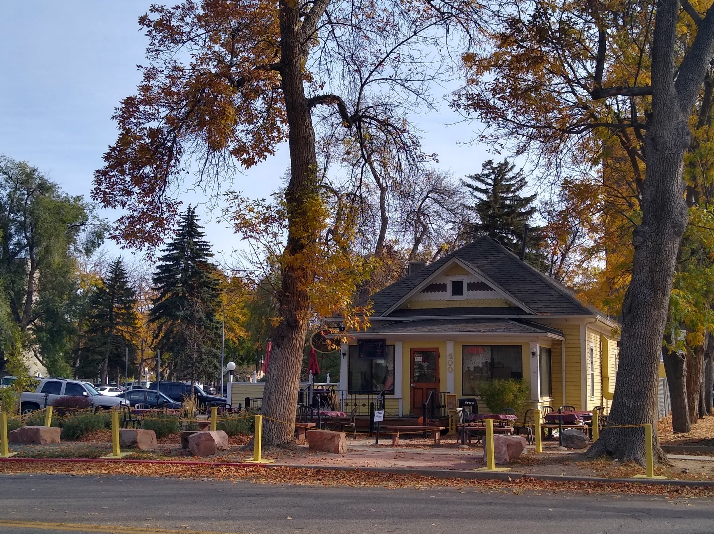
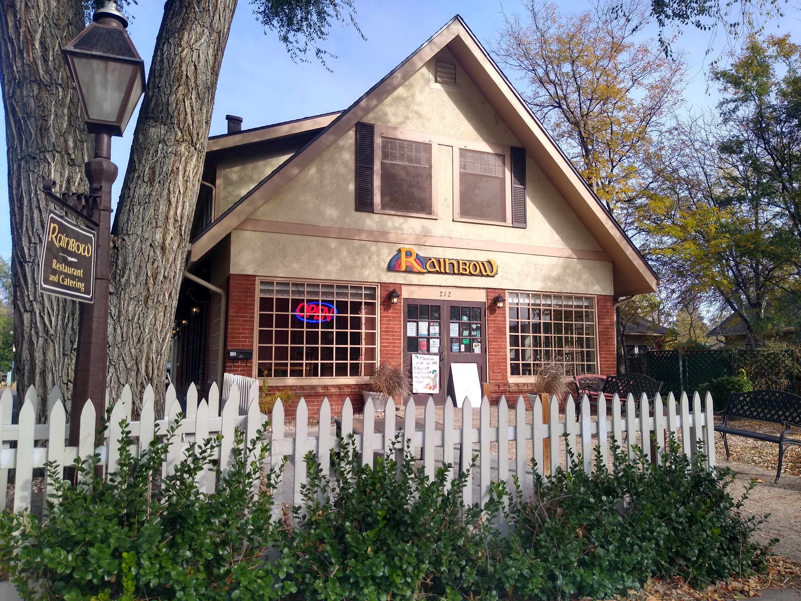
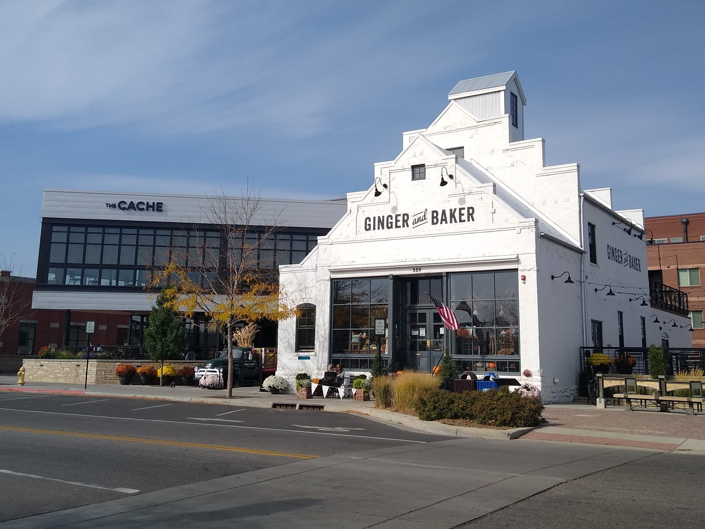

Sweet or savory, whatever your taste buds desire, the best breakfast restaurants in Fort Collins are sure to satisfy your craving. 

From Mexican to Classic American and from vegan to paleo, there's something for everyone whether it's just breakfast or even brunch.

**These are the best breakfast restaurants in Fort Collins:**

## 1. Lucile's

<a href="https://www.luciles.com/ft-collins-location-menu/" target="_blank" rel="noopener noreferrer">Menu for Lucile's</a> 
The perfect place for brunch in Fort Collins, Lucile's is a Creole themed breakfast and lunch restaurant located just between the CSU campus and downtown Fort Collins. 

## 2. Snooze A.M. Eatery
<a href="https://order.snoozeeatery.com/menu/ft-collins" target="_blank" rel="noopener noreferrer">Snooze A.M. Menu</a> 
A relatively new, yet extremely popular breakspot in Fort Collins, Snooze A.M. takes pride in serving delicious food at a reasonable price, while responsibly sourcing all of their ingredients.

## 3. Silver Grill
<a href="https://www.silvergrill.com/breakfast-2/" target="_blank" rel="noopener noreferrer">Silver Grill Menu</a> 
When a restaurant is 90 years old, you know they must be serving fantastic food. The oldest restaurant in northern Colorado, being founded back in 1933, Silver Grill is a staple in the Fort Collins food scene and after you try their famous giant cinnamon rolls you’ll know how they’ve been able to stay in business for so long.

## 4. Urban Egg
<a href="https://www.urbaneggeatery.com/menus/" target="_blank" rel="noopener noreferrer">Urban Egg Menu</a> 
Awarded the "Best Pancakes in Colorado" by Reader's Digest, the unique cinnamon swirl pancakes at Urban Egg are a must try at this popular Colorado based franchise.

## 5. Rise! A Breakfast Place
<a href="http://riseabreakfastplace.com/menu-2/" target="_blank" rel="noopener noreferrer">Rise! Menu</a> 
A few miles from downtown Fort Collins, but definitely worth the visit, Rise! takes pride in offering fresh wholesome foods prepared from scratch in a warm inviting atmosphere.

## 6. La Creperie & French Bakery
<a href="https://fortcollinscreperiebakery.com/breakfast-lunch-menu/" target="_blank" rel="noopener noreferrer">La Creperie Breakfast Menu</a> 
La Creperie Fort Collins is the real deal when it comes to authentic french crepes and pastries. The founder is from Brittany, France, the nest of crepes and galettes, and brought know-how and authenticity right here to Fort Collins.

## 7. Rainbow Restaurant

<a href="https://rainbowfoco.com/breakfast-menu/" target="_blank" rel="noopener noreferrer">Rainbow Restaurant Menu</a> 
Being in Fort Collins for over 40 years and serving traditional, vegetarian, vegan, and gluten-free dishes, you can't go wrong with a morning out at Rainbow Restaurant Fort Collins.

## 8. The Breakfast Club
<a href="https://1fd599aa-d4be-4a03-a434-1cceb13c8d10.filesusr.com/ugd/0f53ad_a3516a44a5e14fa89ed36e296c6b2d3f.pdf" target="_blank" rel="noopener noreferrer">The Breakfast Club Menu</a> 
Serving the classic American favorites at a reasonable cost, The Breakfast Club is a local's favorite that has proudly operated on the southside of town since 2000.

## 9. Cafe Bluebird
<a href="https://www.cafebluebird.com/menu" target="_blank" rel="noopener noreferrer">Cafe Bluebird Menu</a> 
Serving a variety of comfort foods and being known as "the coziest cafe in Fort Collins", Cafe Bluebird is the perfect choice for a hearty breakfast on a cold or after a long night out.

## 10. Ginger and Baker

<a href="https://gingerandbaker.com/wp-content/uploads/2020/10/Ginger-and-Baker-Menu-Fall-10-2020-1.pdf" target="_blank" rel="noopener noreferrer">Ginger and Baker Menu</a> 
The most unique and dynamic choice on our list, Ginger and Baker is the new kid on the block with a lot to offer. Having a classic cafe serving breakfast all day, an in-house local market and bakery, and even a fine dining rooftop restaurant called "The Cache", be sure to check the time because it’s too easy to spend half of your day here.

## 11. Mountain Cafe
<a href="https://image.zmenu.com/menupic/1411724/f906e0bf-181d-4f3b-8573-436a17f04c99.jpg" target="_blank" rel="noopener noreferrer">Mountain Cafe Menu</a> 
A menu loaded with all of your favorites, from omelets to biscuits and gravy, and numerous reviews saying the "best french toast I’ve ever had”, Mountain Cafe is a long time local’s favorite located just one block west of College in downtown Fort Collins.

## Conclusion
Classic American favorites to foreign cuisines, as well as some of the oldest restaurants in the state to some just starting out, the best breakfast restaurants in Fort Collins have accommodating menus that are sure to satisfy any craving.