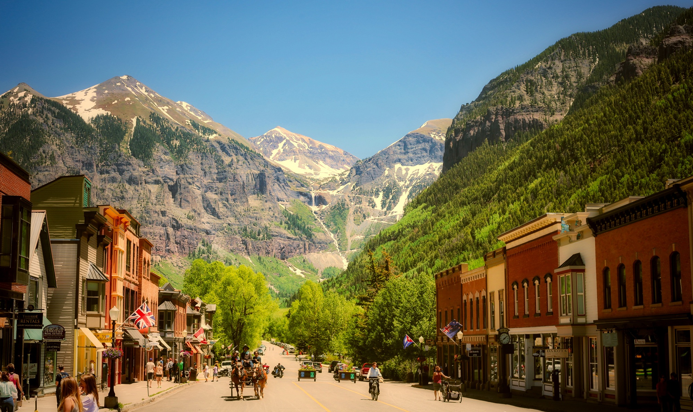
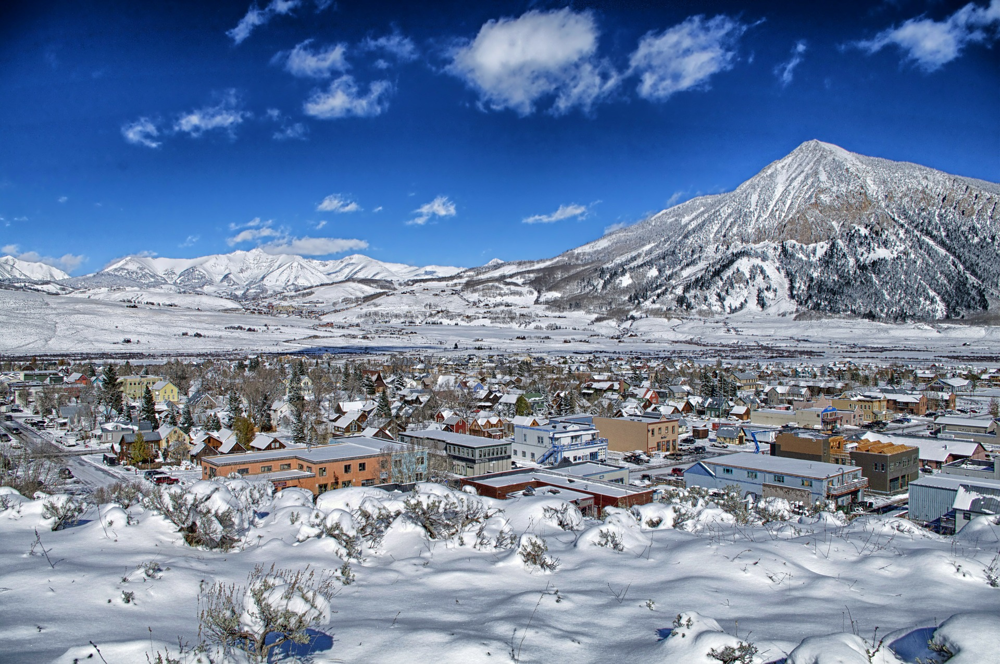
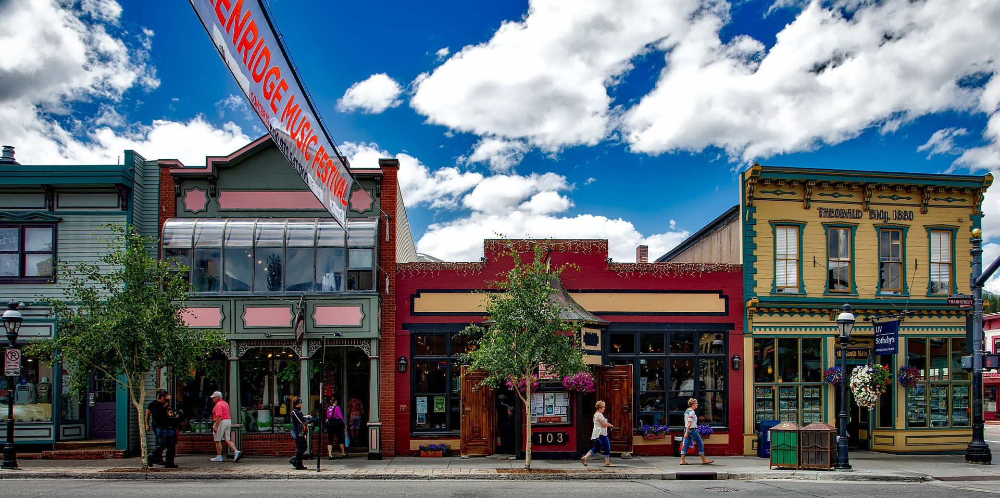
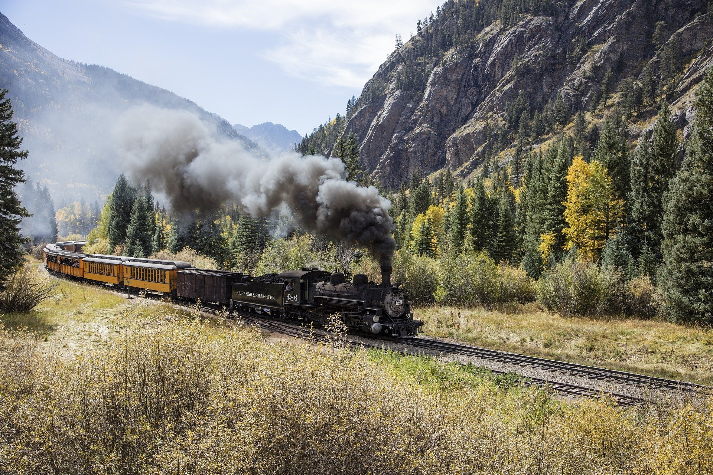
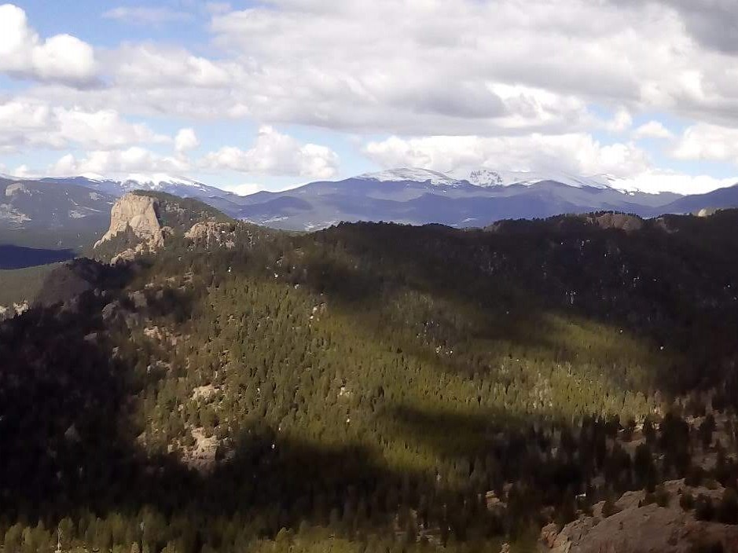
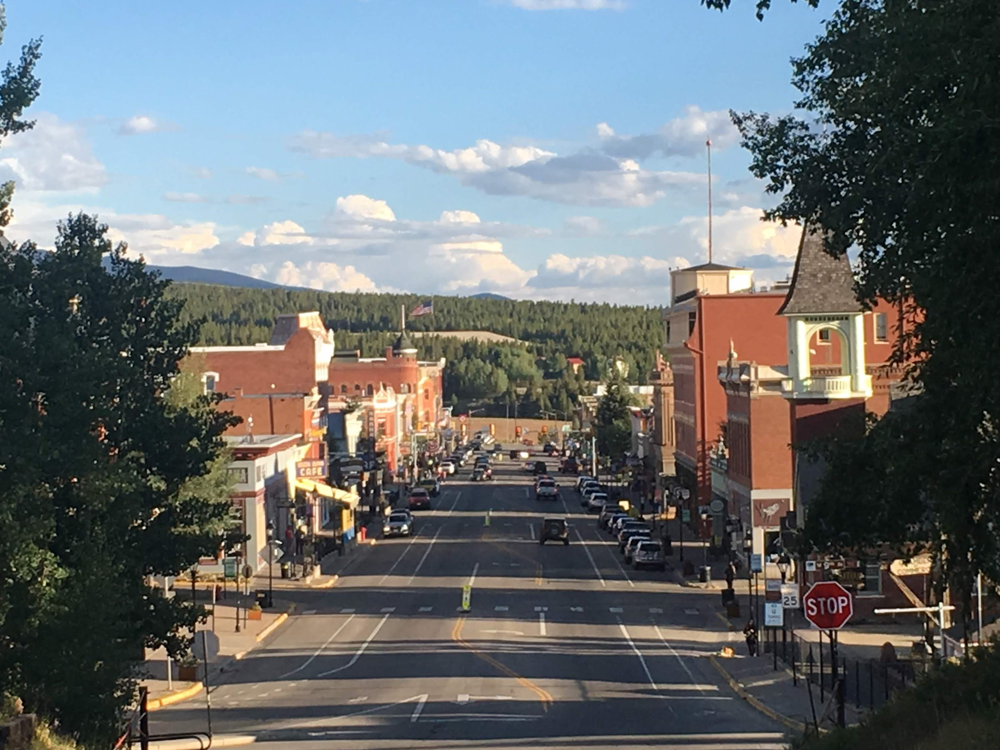

From paddle boarding and hiking, to coffee shops and muesems there's plenty of things to do in Fort Collins, Colorado for people from all walks life. Fort Collins is a thriving little city in far northern Colorado that's known for its quirky vibe, artsy culture, and environmental awareness. Downtown being located just a few miles east of the mountains, it's too easy to start your day with a hike before making your way downtown for brunch.

## What are the things to do in Fort Collins?

**These are the best things to do in Fort Collins:**
### 1. Telluride

### 2. Crested Butte

### 3. Steamboat Springs

### 4. Breckenridge 

### 5. Aspen 

### 6. Estes Park 

### 7. Vail 

### 8. Granby 

### 9. Durango 

### 10. Evergreen 

### 11. Leadville 

