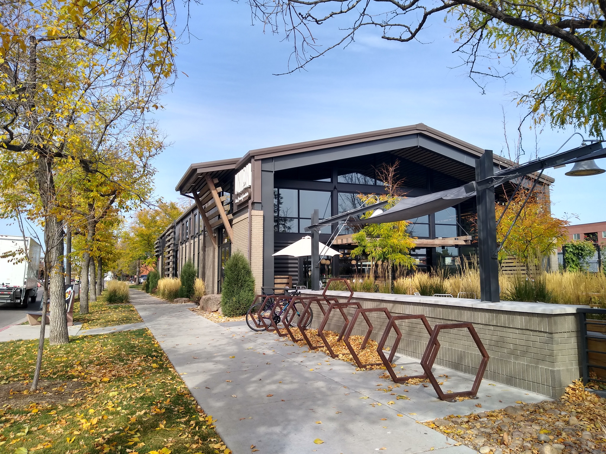
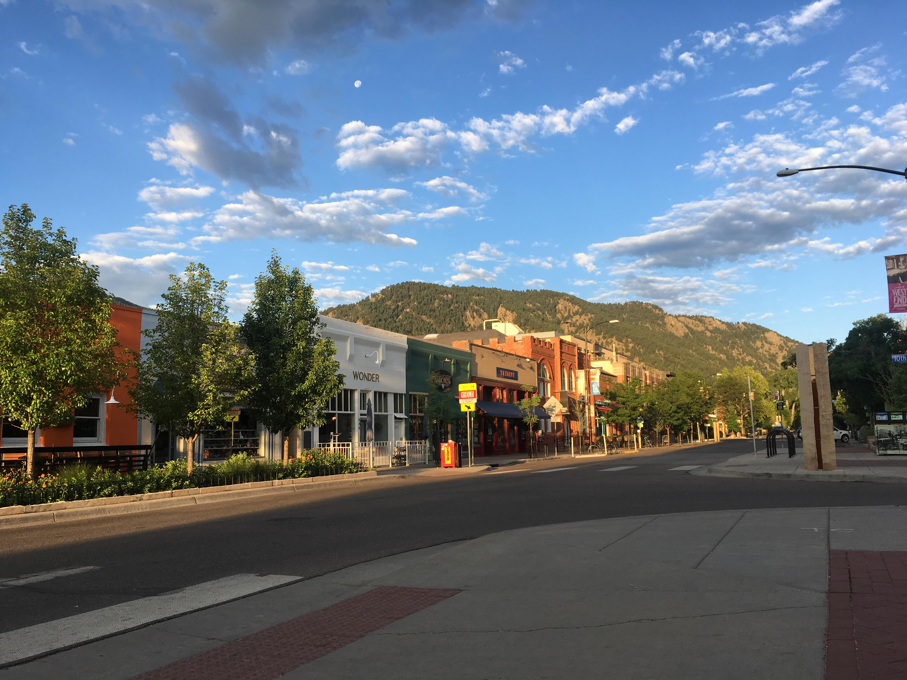

More than just hiking trails and farmer’s markets, the best places to live in Colorado are also home to some of the hottest economies and most innovative companies in the country. 

Most people are attracted to the state because of its cute mountain towns and opportunity for outdoor adventure, but then often turn to the Front Range out of practicality.

## What are the best places to live in Colorado?
Big cities, outdoorsy suburbs, and progressive towns make up the best places to live in Colorado. 

With healthy living and a taste for culture being a staple amongst most of them, you're likely to be satisfied regardless of where you choose to live.

**These are the best places to live in Colorado:**

### 1. Colorado Springs

  

    <em>population:</em> 
    <b>472,688</b>
  

  

    <em>average home price:</em> 
    <b>$336,611</b>
  

Having quick access to the mountains, a thriving economy, and some of the most reasonably priced homes in the state is what makes Colorado Springs the best place to live in Colorado. This town is also home to the Garden of the Gods, Olympic Training Center, Air Force Academy, and Pikes Peak making it a popular vacation destination. Colorado Springs is the cheapest place to live in Colorado that has immediate access to the mountains and all of the big city amenities.

### 2. Fort Collins

  

    <em>population:</em> 
    <b>167,830</b>
  

  

    <em>average home price:</em> 
    <b>$435,747</b>
  

The perfect balance between development and conservation, Fort Collins offers a harmonious lifestyle that can be difficult to find anywhere else in the world. A short ride down one of the many bike paths here, past a few breweries and through the university will be all that it takes to show you why this is such a great place to live. Located just an hour northeast of Estes Park and an hour south of Cheyenne, there’s plenty of opportunity here for weekend trips to the mountains or surrounding regions.

### 3. Boulder

  

    <em>population:</em> 
    <b>107,353</b>
  

  

    <em>average home price:</em> 
    <b>$770,097</b>
  

Boulder is a gem of Colorado and a thriving little melting pot of some of the world’s most top tier talent. From olympians to scientists and tech gurus to Fortune 500 CEOs, they can all be found in this town of just over 100,000 people. The active lifestyle, artsy culture, and progressive initiatives are what create such a high quality of living here and ultimately such an attractive place to live. The secret has been out for awhile now though and home prices have skyrocketed to some of the highest in the state making it not such a practical place to live. With cheaper housing, Boulder would easily move to the top of this list.

### 4. Golden

  

    <em>population:</em> 
    <b>21,254</b>
  

  

    <em>average home price:</em> 
    <b>$634,229</b>
  

A lesser known suburb of Denver that often flies under the radar, Golden feels a world away from the big city as it sits nestled in between the mountains and the large plateau that separate it from the rest of the metropolitan region. One of the original mining towns in Colorado, Golden has a rich history that sits in plain sight in the form of historic buildings and museums which gives it a unique feeling of authenticity. With a light rail system connecting this suburb to Denver, it’s an ideal place for commuters who are not yet ready to give up small town living.

### 5. Denver

  

    <em>population:</em> 
    <b>716,492</b>
  

  

    <em>average home price:</em> 
    <b>$466,601</b>
  

The capital and largest city in the great state of Colorado, Denver boasts an outdoorsy culture, booming economy, thriving art scene, and quick mountain access that compares to very few other large cities. This has made Denver an outstanding city to live in and has ultimately caused the population to explode here over the past decade. Although healthy living is a staple of the culture here, this city is no exception to the common downsides of densely populated areas such as traffic and pollution.

### 6. Lakewood

  

    <em>population:</em> 
    <b>156,798</b>
  

  

    <em>average home price:</em> 
    <b>$457,166</b>
  

Arguably one of the best suburbs of Denver, Lakewood is the perfect place for those looking to strike a balance between the big city life and the great outdoors. Located in the foothills right in between downtown Denver and the mountains, Lakewood is scattered with open space parks making access to nature never more than just a few minutes away. With the world famous Red Rocks Amphitheatre just 15 minutes away in Morrison and Loveland ski resort just 35 minutes west on I-70, Lakewood truly is the perfect place for anyone looking to have the best of both worlds.

### 7. Grand Junction

  

    <em>population:</em> 
    <b>63,374</b>
  

  

    <em>average home price:</em> 
    <b>$272,966</b>
  

The most western city in the state of Colorado and having a population of just over 60,000, Grand Junction thrives with a sense of solitude that can’t be found in any of the other large towns in Colorado. Being far removed from other population centers, Grand Junction has a slow pace that often makes you feel as if you've gone back in time. Although this town is not a bustling city, they’ve enacted many initiatives to diversify their economy in the upcoming years that will allow them to become a larger player on the national stage. This doesn’t only make Grand Junction an appealing place to live, but very practical as we all strive to find that perfect work-life balance.

### Conclusion
Outdoor adventure, corporate careers, or everything in between, whatever brings you to Colorado you are sure to discover a place that's easy for you to call home. The best places to live in Colorado are consistently changing as our state continues to grow. The only way to know for sure where the best place is to live is to make the move and experience these places for yourself.

