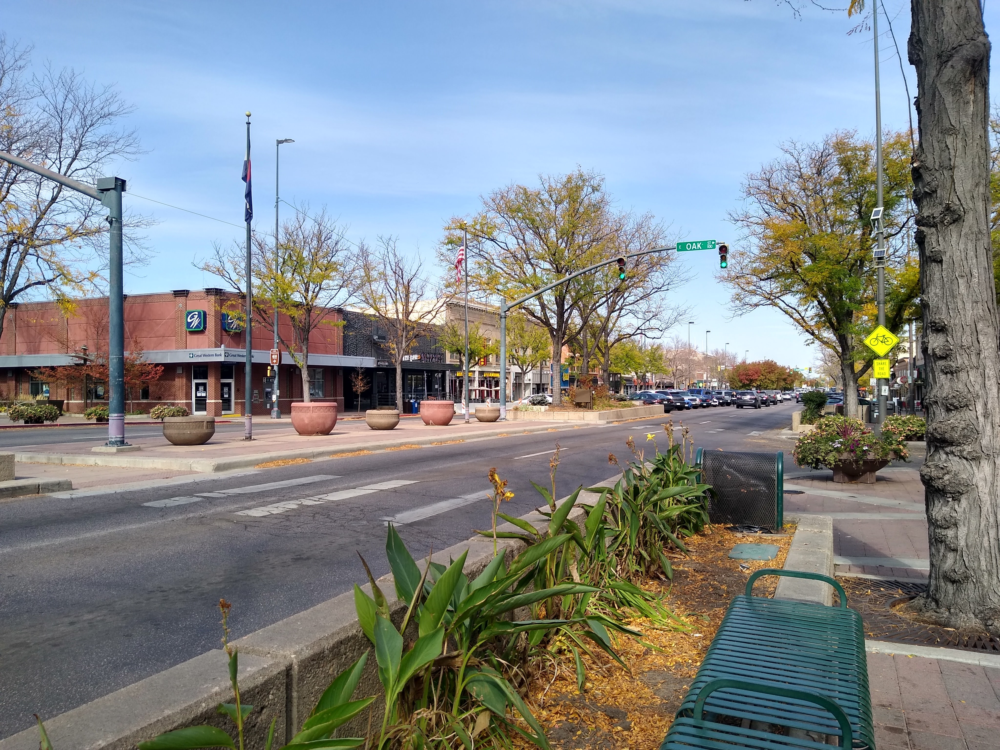
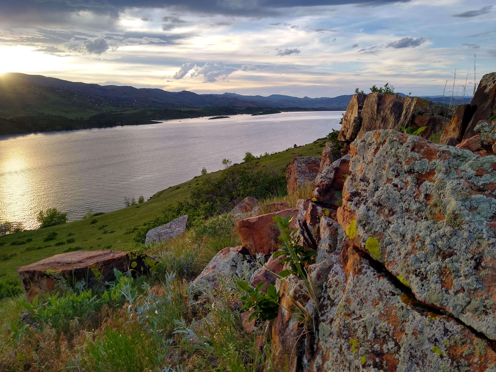
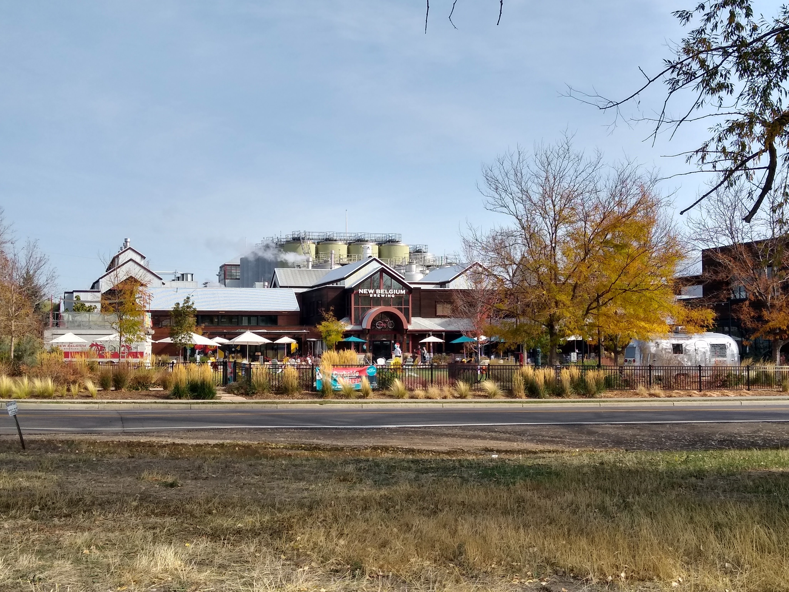
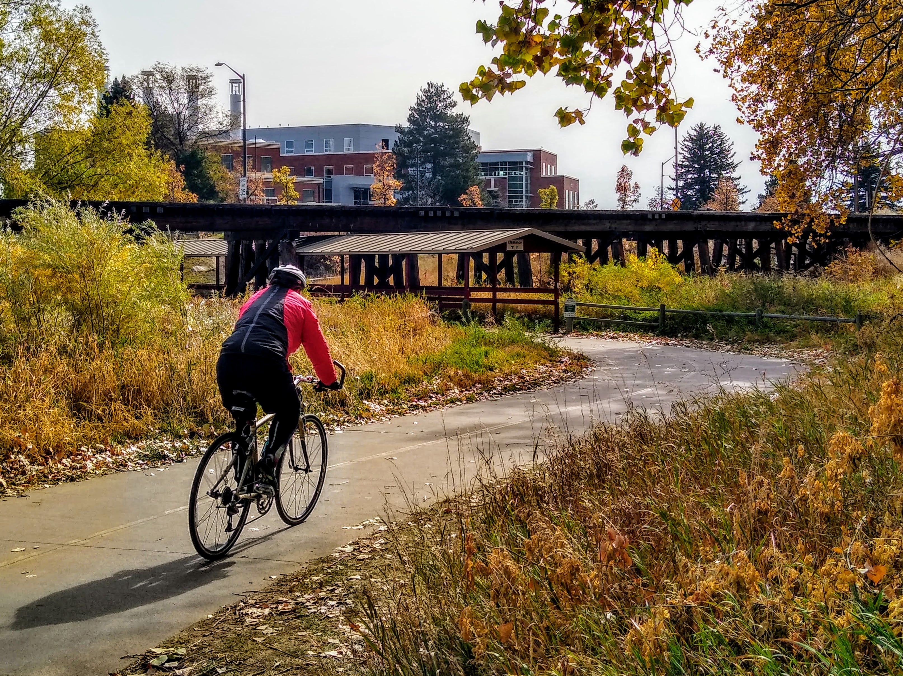
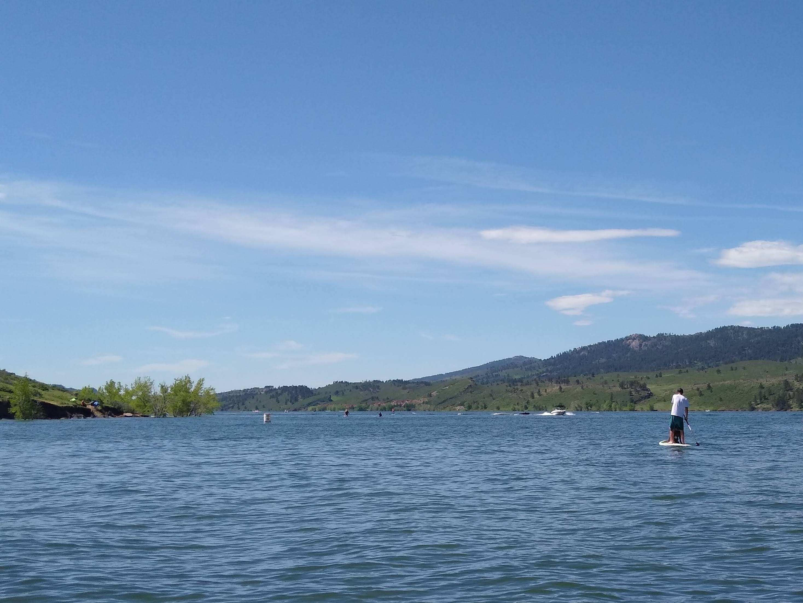
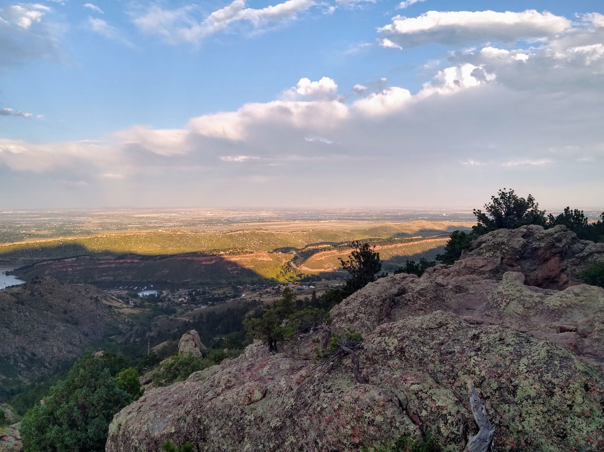

From paddle boarding and hiking, to coffee shops and muesems there's plenty of things to do in Fort Collins, Colorado for people from all walks life. Fort Collins is a thriving little city in far northern Colorado that's known for its quirky vibe, artsy culture, and environmental awareness. Downtown being located just a few miles east of the mountains, it's too easy to start your day with a hike before making your way downtown for brunch.

## What are the things to do in Fort Collins?

**These are the best things to do in Fort Collins:**
### 1. Walk around downtown

Full of the small town charm you would hope to find in a Colorado mountain town, downtown Fort Collins is a vibrant arts and cultural hub for northern Colorado.

### 2. Hike at Horsetooth Reservoir

The quick mountain escape for most Fort Collins residents, Horsetooth Reservoir is a vast body of water surrounded by hiking trails and breath taking views just a 7 minute drive west of downtown.

### 3. New Belgium Brewery Tour

World famous New Belgium Brewing has called Fort Collins home since they opened their doors in the 80's. Their brewery tour is one of the best and offers several opportunities for free beer.

### 4. Attend a concert at The Mishawaka
Colorado is home to several of the most beautiful outdoor amphitheatres in the country and The Mishawaka just outside of Fort Collins is one of them.

### 5. Explore the Museum of Discovery

### 6. Ride bikes on the Poudre Trail

### 7. Visit the Farmer's Market

### 8. Relax in Martinez Park

### 9. Paddle Board at Horsetooth Reservoir

### 10. Drive up the Poudre Canyon

### 11. Explore Lory State Park

### 11. Hike to the top of Horsetooth Rock

### 12. Sip Coffee at a Local Coffee Shop

### 13. Walk through the historic distric

### 14. Bike the Spring Creek Trail

### 15. Explore CSU Campus

### 16.

### 17.

### 18. Watch the wildlife at Spring Creek

### 19. 

