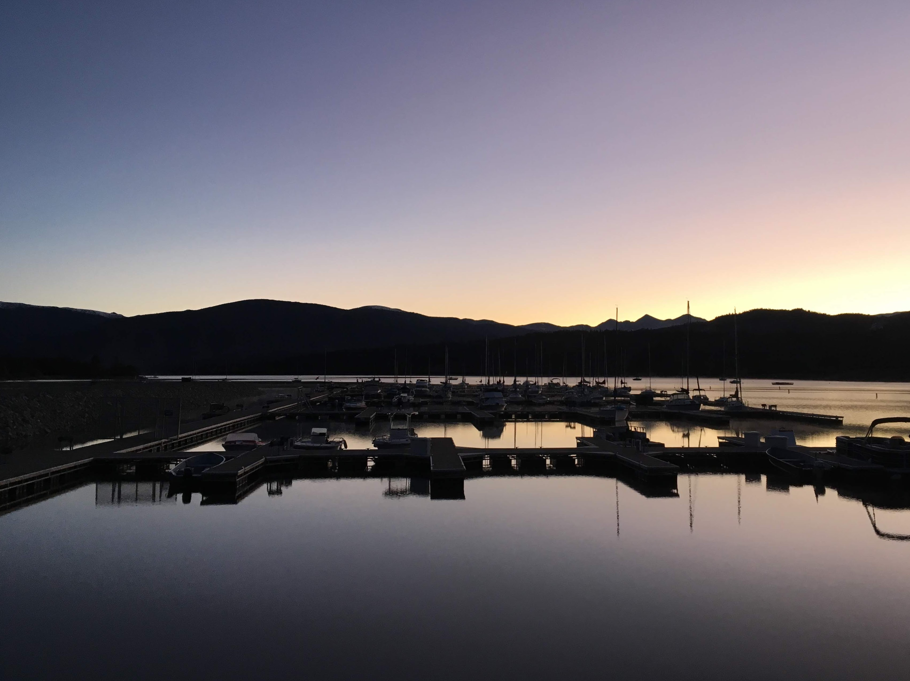
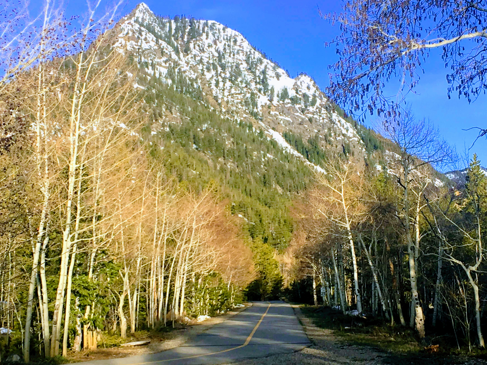
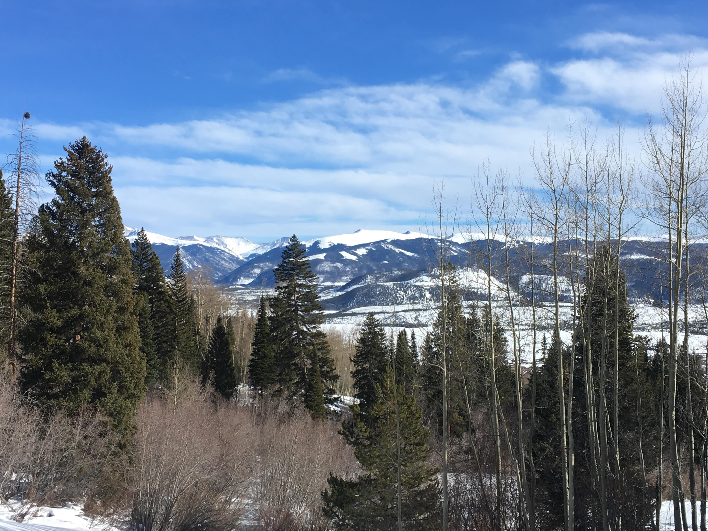
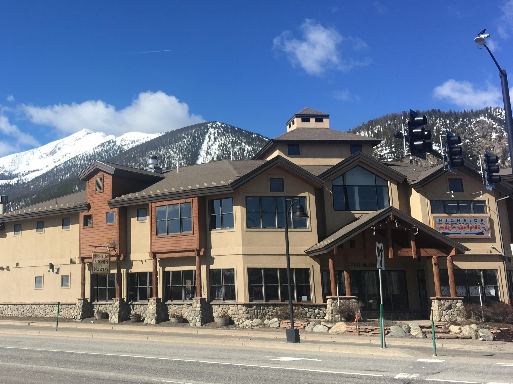

## What are the things to do in Frisco?

**These are the things to do in Frisco, Colorado:**

## 1. Paddleboard on Dillon Reservoir

At 9,017 ft. this is the world's highest deep water marina. They offer kayak, paddleboard, and boat rentals which makes it easy to explore the lake and witness breathtaking views of the town from a new perspective.

## 2. Bike the Tenmile Recpath

A 7.2 mile paved bike path that links downtown Frisco to Copper Mountain. Even if you don't make it all the way to Copper Mountain, the path wraps around Frisco and offers fantastic views and solitude as it meanders through the woods.

## 3. Tubing at the Frisco Adventure Park
With the help of man-made snow, Frisco is able to opperate a world-class tubing hill for more than half of the year. Their convayer system also brings tubers to the top of the hill with ease which makes for a fun experience as you don't have to battle walking up hill at such high altitude.

## 4. Hike the Ten Mile Creek Trail

The Ten Mile Creek trail is the best way to explore the surrounding White River National Forest. It's relatively mellow and is a fun hike year round. The trailhead sits just at the end of Main St. making it easy to work this activity into your day of adventure.

## 5. Enjoy local craft beer at a brewery

Outer Range Brewing and Highside Brewing are the two breweries in Frisco, Colorado. It doesn't take much time to realize that craft breweries are a staple of the mountain communities and are the local's water hole after a long day of adventure.

## 6. Climb Tenmile Peak
The majestic peak that prominently overlooks Frisco, known as Tenmile Peak, rises to an elevation of 12,933 ft. and climbing it makes for an adventure that you will never forget. At 10 miles round trip and roughly a 5,000 ft. elevation gain, this is a major undertaking and should not be taken lightly. Please brush up on mountain safety before considdering this.

## 7. Kayak at the Whitewater Park
Whitewater parks are a luxury of many mountain towns and Frisco is no exception. With easy entry and exit points from the river and being located just at the end of Main St., this park makes it easy to experience the adrenaline of whitewater kaying without even leaving town.

## 8. Hike around Lake Dillon
The forest on the north side of the lake, starting near Frisco, offer outstanding hiking. With few designated trails, but having the lake on one side and the interstate on the other, make this the perfect place to explore without the worry of getting lost.

## 9. Discover Frisco's Neighbors
With 5 other mountain towns within 15 minutes of Frisco, all being connected by a free bus system, exploring the surrounding areas is always fun.
